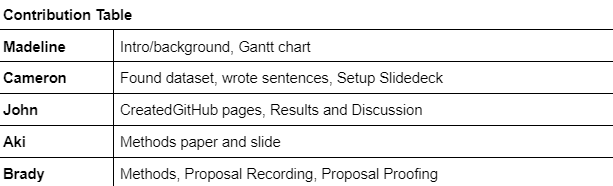
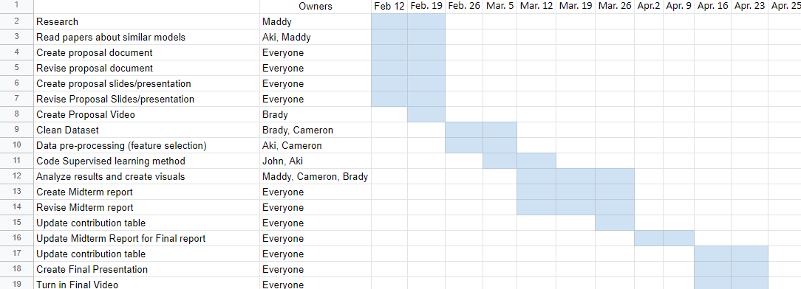

# ML_Project
## Introduction/Background:
Alzheimer’s disease (“AD”) is an increasingly prevalent condition in aging adults characterized by a debilitating cognitive decline, most notably in memory function (“dementia”). Although AD is mostly seen in adults ages 70+, early onset dementia is known to occur in younger adults (Scheltens, et al., 2021). Pathogenesis of the disease has been associated with an accumulation of β-amyloid (“Aβ”) peptides into masses known as “amyloid plaques” that form in the brain. These plaques, visible on MRI scans, are the main diagnostic criteria for AD (Gouras, Olsson, & Hansson, 2014). The degree to which these plaques have spread and are visible on the scans is directly correlated to the degree of dementia experienced by an AD patient (Cummings & Cotman, 1995). Therefore, an automated tool to assess not only the presence of AD and/or dementia but also its degree would help speed up and further calibrate the diagnostic process. This would facilitate more accurate diagnoses and provide more time for patients and their loved ones to determine a course of action and intervention plan.

## Problem:
In this project, we want to design a highly accurate model that can look at a .jpg of an MRI scan and classify whether the patient’s brain is non-demented, very mildly demented, mildly demented, or moderately demented. 

## Methods:
To analyze the images we will mostly be utilizing convolutional neural networks in pytorch. Though CNNs will be the base of our model, depending on the necessary complexity, more features will be added. ResNets, or residual networks, are highly applicable to image classification as it was used to win the 2015 ImageNet competition (He, et al., 2016). From ResNets, we may pull the idea of skip connections to use in our model (Oyedotun, et al., 2021). Attention mechanisms may also be useful in our model to be able to specify which parts of the image are referenced for the final classification decision (Vaswani, et al, 2017).

## References for us:

https://ieeexplore.ieee.org/document/8320684 - image processing

https://blog.paperspace.com/image-classification-with-attention/ - attention intro

https://www2.cs.sfu.ca/~hamarneh/ecopy/ipmi2019.pdf - melanoma with visual attention

## Results and Discussion:

There are many potential ways to quantify the data, and there is likely no single best fit. We will start by using a simple accuracy metric, which should provide a baseline level of information regarding the success of our system. We will refine our success metrics as time goes on.

## Contribution Table:

## Gantt Chart

