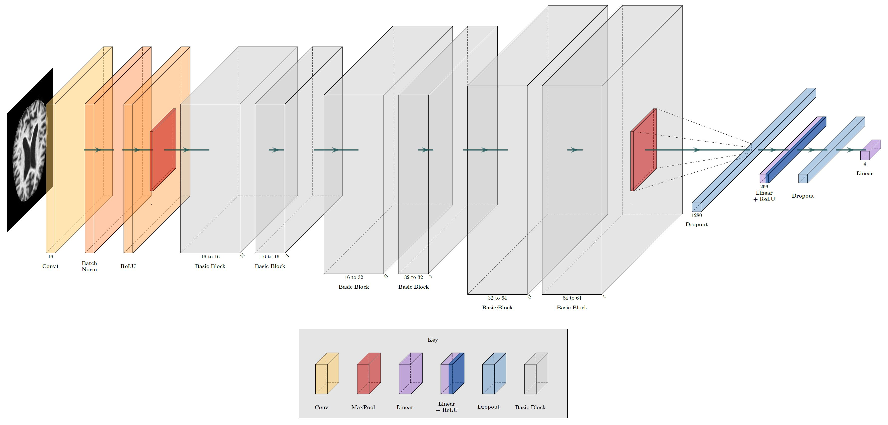

# ML Final Report
## Introduction/Background:
Alzheimer’s disease (“AD”) is an increasingly prevalent condition in aging adults characterized by a debilitating cognitive decline, most notably in memory function (“dementia”). Although AD is mostly seen in adults ages 70+, early onset dementia is known to occur in younger adults (Scheltens, et al., 2021). Pathogenesis of the disease has been associated with an accumulation of β-amyloid (“Aβ”) peptides into masses known as “amyloid plaques” that form in the brain. These plaques, visible on MRI scans, are the main diagnostic criteria for AD (Gouras, Olsson, & Hansson, 2014). The degree to which these plaques have spread and are visible on the scans is directly correlated to the degree of dementia experienced by an AD patient (Cummings & Cotman, 1995). Therefore, an automated tool to assess not only the presence of AD and/or dementia but also its degree would help speed up and further calibrate the diagnostic process. This would facilitate more accurate diagnoses and provide more time for patients and their loved ones to determine a course of action and intervention plan.

## Problem:
In this project, we want to design a highly accurate model that can look at a .jpg of an MRI scan and classify whether the patient’s brain is non-demented, very mildly demented, mildly demented, or moderately demented. 

## Dataset and Data Collection

Our dataset is [Alzheimer's Dataset ( 4 class of Images)](https://www.kaggle.com/datasets/tourist55/alzheimers-dataset-4-class-of-images) from Kaggle. It is composed of 6400 .jpg images, where each image represents a layer of an MRI scan. The images are divided into one of four categories: non-demented, very mildly demented, mildly demented, or moderately demented. The break-down of these files are as follows:

These scans are sourced from Open Access of Imaging Studies (OASIS). Dementia severity was assessed using the Clinical Dementia Rating (CDR) scale (Marcus, et al., 2010).

We did not need to clean the dataset; this had already been done by OASIS.

## Methods:

To analyze the images we will be utilizing convolutional neural networks in pytorch. Though CNNs will be the base of our model, depending on the necessary complexity, more features will be added. ResNets, or residual networks, are highly applicable to image classification as it was used to win the 2015 ImageNet competition (He, et al., 2016). From ResNets, we focus on the idea of skip connections to use in our model (Oyedotun, et al., 2021).

We created four preprocessing functions that simplified the images in some way to decrease the information load into the neural network. These were oversampling, cropping, PCA, and categorizing. Oversampling simply oversampled our size limited classes (mildly demented, moderately demented) in order to force the model to learn all classes instead of settling for placing all predictions into one class. This, however, proved ineffecitve in improving the model accuracy and was omitted from any final model training. The cropping function cuts out most of the black space in the margins of the images. It checks over the average light level over a border row or column and removes it if it is under a certain threshold brightness level. For our implementation, light threshold 0 was used. PCA extracts the most variable features from the image. This has a downside of flattening the image. The categorizing function splits the pixels into three categories, off, half on, and on.

The script sets hyperparameters and initializes the model and optimizer. If a checkpoint file exists, it loads the model and optimizer state from the file. It then sets up a log writer to write the results of each epoch to a CSV file. The model is trained for a specified number of epochs, where each epoch shuffles the training data and loops through batches of the data to perform forward and backward passes to optimize the model weights. During each batch, the loss and accuracy are calculated, and the values are appended to lists for the current epoch. After all batches are processed, the mean loss and accuracy for the epoch are calculated and written to the log writer. 

ResNet

ResNet is a Deep Convolutional Neural Network (DCNN), which means that it has a large number of convolutional layers used to categorize images. It uses “skip connections”, which are an attempt to prevent overfitting and solve the vanishing gradient problem. Our architecture starts with an initial pass through a convolutional layer with batch normalization, ReLU activation, and max pooling. This is followed by passing the data through 3 layers, each consisting of 2 blocks of 2 to 3 convolutions each. This is followed by flattening and applying a dropout, which will prevent overfitting. Finally, the data is passed through 2 fully connected linear layers to produce an output.

AlexNet

Our AlexNet implementation consists of five convolutional layers which are then flattened and passed through three fully connected layers. The first, second, and fifth convolutional layers are followed by a MaxPool. ReLU activation is used after each convolutional and fully connected layer except for the last fully connected layer, which is followed by a SoftMax activation. Dropout is used after the first fully connected layer to prevent overfitting. Finally, we use the cross-entropy loss function to calculate the loss and the Adam optimizer to implement weight decay. The model was trained with a batch size of 2048 and 50 epochs.

ResNetLite

ResNetLite is a highly simplified version of ResNet above. It features the same initial pass through a convolutional layer with batch normalization, ReLU activation, and max pooling. Following that, there are only 3 blocks, of 2 to 3 convolutions each, depending on if downsampling is necessary. This is the same block as that for ResNet. This is followed by flattening, dropout, and 2 fully connected linear layers to bring the size down to 4. This network features more maxpool layers than ResNet to speed up the reduction of features.

PCANet

PCANet preprocesses each image, extracting the axes with the greatest variability. This process flattens the image. In extracting the important features of the image and greatly reducing its feature size, it loses the 2D properties of the image. The 1D tensor is passed through 9 Linear layers, first increasing the size to 2048, and slowly decreasing to 4, the number of categories.

## Results

Currently our data pre-processing includes cropping each image by 10 pixels on either side reducing the image size from 208x176 to 176x144. This is helpful as every image has large black borders surrounding the actual image of the brain, alleviating pressure on the model. The image data is also normalized by dividing by 256, forcing every pixel value to be a number between [0, 1]. 

Other important aspects of the model include using Adam as an optimizer and categorical cross entropy as the loss function. 

ResNet

ResNet reached its highest accuracy of 62.3 at step 48. This model took 50 minutes to run. This model is modified and improved in ResNetLite.

AlexNet

AlexNet peaked at 56.6% accuracy after 1 hour and 20 minutes of training. The losses, however, began to diverge at Step 12. This indicates that the model began overfitting. Overall, AlexNet performed well with a simpler architecture than ResNet but could not match the speed or accuracy.

ResNetLite

This model’s best accuracy was 67.47% and occurred at step 40. Overall, this model took 66 minutes and 50 seconds to run. 

PCANet

This model took just over 1 minute to run, but never “learned” anything. As shown, every test image was assigned to the “Non-Demented” category, giving an overall accuracy of 50%.

## Discussion:

After many iterations of the models and fine tuning hyperparameters, ResNetLite produced the best model to predict the severity of Alzheimer’s in a patient. Although it took 16 more minutes to run than ResNet, ResNetLite peaked at an accuracy of 67.47%. This was a 5.17% improvement on ResNet, a 10.87% improvement on AlexNet, and a 17.47% improvement on PCANet.

The team’s main problem was the lack of diversity in the testing dataset, as many of our models incorrectly placed a lot of the test dataset into the Non-Demented category. This is likely due to Non-Demented scans comprising half of the dataset, leaving the other half to be disproportionately composed of the 3 demented categories. The more severe the Alzheimer’s category, the less it was represented within the dataset. The team tried to work around this by implementing many different structures of models and utilizing the weight parameters in many models. Oftentimes, this resulted in overfitting on the train dataset, which is demonstrated by a divergence in train and test losses in the loss graphs. The train loss would sharply decrease, while the test loss remained volatile throughout the 50 steps.

Overall, we consider a 67.47% test accuracy a success. Although the model is not accurate enough for immediate clinical application, which would require a significantly higher accuracy (likely around 95%), it is a promising foundation for a computer-assisted Alzheimer’s diagnostic tool. Future improvements to the model would include gathering more data on patients with varying degrees of dementia, adding a fifth class for patients who are severely demented, and continuing to fine-tune the model to optimize accuracy and efficiency.

## Contribution Table:

## Works Cited

Cummings, B. J., & Cotman, C. W. (1995). Image analysis of β-amyloid load in Alzheimer's disease and relation to dementia severity. The Lancet, 346(8989), 1524-1528.

Gouras, G. K., Olsson, T. T., & Hansson, O. (2015). β-Amyloid peptides and amyloid plaques in Alzheimer’s disease. Neurotherapeutics, 12, 3-11.

He, K., Zhang, X., Ren, S., & Sun, J. (2016). Deep residual learning for image recognition. In Proceedings of the IEEE conference on computer vision and pattern recognition (pp. 770-778).

Marcus, D. S., Fotenos, A. F., Csernansky, J. G., Morris, J. C., & Buckner, R. L. (2010). Open access series of imaging studies: longitudinal MRI data in nondemented and demented older adults. Journal of cognitive neuroscience, 22(12), 2677–2684. 

Oyedotun, O. K., Al Ismaeil, K., & Aouada, D. (2022). Why is everyone training very deep neural network with skip connections?. IEEE Transactions on Neural Networks and Learning Systems.

Scheltens, P., De Strooper, B., Kivipelto, M., Holstege, H., Chételat, G., Teunissen, C. E., ... & van der Flier, W. M. (2021). Alzheimer's disease. The Lancet, 397(10284), 1577-1590.

Selvaraju, R. R., Cogswell, M., Das, A., Vedantam, R., Parikh, D., & Batra, D. (2017). Grad-cam: Visual explanations from deep networks via gradient-based localization. In Proceedings of the IEEE international conference on computer vision (pp. 618-626).

Vaswani, A., Shazeer, N., Parmar, N., Uszkoreit, J., Jones, L., Gomez, A. N., ... & Polosukhin, I. (2017). Attention is all you need. Advances in neural information processing systems, 30.

