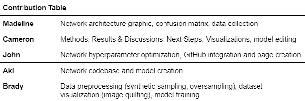

# ML Midterm Report
## Introduction/Background:
Alzheimer’s disease (“AD”) is an increasingly prevalent condition in aging adults characterized by a debilitating cognitive decline, most notably in memory function (“dementia”). Although AD is mostly seen in adults ages 70+, early onset dementia is known to occur in younger adults (Scheltens, et al., 2021). Pathogenesis of the disease has been associated with an accumulation of β-amyloid (“Aβ”) peptides into masses known as “amyloid plaques” that form in the brain. These plaques, visible on MRI scans, are the main diagnostic criteria for AD (Gouras, Olsson, & Hansson, 2014). The degree to which these plaques have spread and are visible on the scans is directly correlated to the degree of dementia experienced by an AD patient (Cummings & Cotman, 1995). Therefore, an automated tool to assess not only the presence of AD and/or dementia but also its degree would help speed up and further calibrate the diagnostic process. This would facilitate more accurate diagnoses and provide more time for patients and their loved ones to determine a course of action and intervention plan.

## Problem:
In this project, we want to design a highly accurate model that can look at a .jpg of an MRI scan and classify whether the patient’s brain is non-demented, very mildly demented, mildly demented, or moderately demented. 

## Methods:
To analyze the images we will mostly be utilizing convolutional neural networks in pytorch. Though CNNs will be the base of our model, depending on the necessary complexity, more features will be added. ResNets, or residual networks, are highly applicable to image classification as it was used to win the 2015 ImageNet competition (He, et al., 2016). From ResNets, we may pull the idea of skip connections to use in our model (Oyedotun, et al., 2021). Attention mechanisms may also be useful in our model to be able to specify which parts of the image are referenced for the final classification decision (Vaswani, et al, 2017).

Our current method for the midterm report involves a five-step forward feature selection. The network consists of three convolutional layers followed by two fully connected layers.

Yellow = Convolutional Layer

Purple = Fully Connected Layer

The script sets hyperparameters and initializes the model and optimizer. If a checkpoint file exists, it loads the model and optimizer state from the file. It then sets up a log writer to write the results of each epoch to a CSV file. The model is trained for a specified number of epochs, where each epoch shuffles the training data and loops through batches of the data to perform forward and backward passes to optimize the model weights. During each batch, the loss and accuracy are calculated, and the values are appended to lists for the current epoch. After all batches are processed, the mean loss and accuracy for the epoch are calculated and written to the log writer.

## Dataset and Data Collection

Our dataset is [Alzheimer's Dataset ( 4 class of Images)](https://www.kaggle.com/datasets/tourist55/alzheimers-dataset-4-class-of-images) from Kaggle. It is composed of 6400 .jpg images, where each image represents a layer of an MRI scan. The images are divided into one of four categories: non-demented, very mildly demented, mildly demented, or moderately demented. The break-down of these files are as follows:

These scans are sourced from Open Access of Imaging Studies (OASIS). Dementia severity was assessed using the Clinical Dementia Rating (CDR) scale (Marcus, et al., 2010).

We did not need to clean the dataset; this had already been done by OASIS.

## References:

[Image Processing](https://ieeexplore.ieee.org/document/8320684)

[Attention Intro](https://blog.paperspace.com/image-classification-with-attention/)

[Melanoma with Visual Attention](https://www2.cs.sfu.ca/~hamarneh/ecopy/ipmi2019.pdf) 

## Results and Discussion

Our results are listed below after running the model.

The table shows the mean train loss, train accuracy, mean test loss, and test accuracy for each step. Overall, it appears that the model improved significantly in terms of test accuracy over the course of the training process. The decrease in mean train loss and mean test loss suggests that the model is learning and improving over time.

The confusion matrix shows the results of the model on the test data.

0 = Non-Demented

1 = Very Mildly Demented

2 = Mildly Demented

3 = Moderately Demented

As mentioned earlier, this is a supervised method so we are able to assign the predicted label and true label in the confusion matrix to visualize these results.  As of now, every image is being assigned to Non-Demented leading to the 50% accuracy. This is not an ideal result from the model. We have been experimenting with different weights tensors to input into the model and different versions of data pre-processing to help the model choose other classifications. Additionally, we are investigating the addition of synthetic sampling to our dataset to generate more samples in the mildly and moderately demented datasets. 

Currently our data pre-processing includes cropping each image by 10 pixels on either side reducing the image size from 208x176 to 188x156. This is helpful as every image has large black borders surrounding the actual image of the brain, alleviating pressure on the model.

Above is an image of a scan before and after it was cropped. Almost all of the relevant information was preserved, but the numebr of features has been decreased quite a bit.

The image data is also normalized by dividing by 256, forcing every pixel value to be a number between [0, 1].

Other important aspects of the model include using Adam as an optimizer and categorical cross entropy as the loss function. 

## Next Steps:

For the final, our goal is to have an accurate model that can identify the other classes of dementedness present in the dataset. To achieve this, we will look into adding more layers to the network architecture and more advanced data preprocessing techniques. We plan to incorporate max pooling and dropout layers to prevent overfitting, batch normalization to standardize input values across each batch and speed up the training process,  and additional convolutional layers to the model to enable better feature detection in the input images. Principal Component Analysis (PCA) along with the potential addition of synthetic samples will be essential to improve our model’s performance through preprocessing.

## Contribution Table:

## Gantt Chart

## Works Cited

Cummings, B. J., & Cotman, C. W. (1995). Image analysis of β-amyloid load in Alzheimer's disease and relation to dementia severity. The Lancet, 346(8989), 1524-1528.

Gouras, G. K., Olsson, T. T., & Hansson, O. (2015). β-Amyloid peptides and amyloid plaques in Alzheimer’s disease. Neurotherapeutics, 12, 3-11.

He, K., Zhang, X., Ren, S., & Sun, J. (2016). Deep residual learning for image recognition. In Proceedings of the IEEE conference on computer vision and pattern recognition (pp. 770-778).

Marcus, D. S., Fotenos, A. F., Csernansky, J. G., Morris, J. C., & Buckner, R. L. (2010). Open access series of imaging studies: longitudinal MRI data in nondemented and demented older adults. Journal of cognitive neuroscience, 22(12), 2677–2684. 

Oyedotun, O. K., Al Ismaeil, K., & Aouada, D. (2022). Why is everyone training very deep neural network with skip connections?. IEEE Transactions on Neural Networks and Learning Systems.

Scheltens, P., De Strooper, B., Kivipelto, M., Holstege, H., Chételat, G., Teunissen, C. E., ... & van der Flier, W. M. (2021). Alzheimer's disease. The Lancet, 397(10284), 1577-1590.

Selvaraju, R. R., Cogswell, M., Das, A., Vedantam, R., Parikh, D., & Batra, D. (2017). Grad-cam: Visual explanations from deep networks via gradient-based localization. In Proceedings of the IEEE international conference on computer vision (pp. 618-626).

Vaswani, A., Shazeer, N., Parmar, N., Uszkoreit, J., Jones, L., Gomez, A. N., ... & Polosukhin, I. (2017). Attention is all you need. Advances in neural information processing systems, 30.

